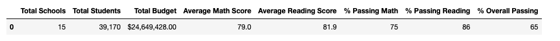

# School_District_Analysis

## Overview of the school district analysis: 
This analysis was conducted to assess all standardized test data to inform and help create decisions on the district level based on trends found. These decisions will help better inform budget allotments for future years based on the scores by school spending per student, school size, and by school type. However, after an initial analysis was conducted it has been found that 9th grade students at Thomas High School show evidence of academic dishonesty in their math and reading scores. Because of this, 9th grader's scores at this school were replaced with NaNs and then the initial analysis is repeated with the trace of academic dishonesty removed from our data frame. 

## Results: 
- After removing the 9th grade student scores, the means of the math and reading score columns are recalculated. The average math score decreased by 0.1% in the new district summary and the average reading score stayed the same. The percent passing columns in the data frame changed as well. The percent passing math decreased by 0.2%, the percent passing reading decreased by 0.3% and the percent passing overall decreased by 0.1%

Initial District Summary: 

New District Summary: 

- The school summary data frame is mostly unchanged by the removal of 9th graders from Thomas high schools score, however the data from Thomas high school was slightly altered. Average math scores went from 83.41% to 83.35%. Average reading scores increased from 83.84% to 83.89%. The Passing math score decreased from 93.27% to 93.18%. The passing reading percentage decreased from 97.3% to 97.01%. Finally, the overall passing percentage went from 90.95% to 90.63%.

Initial School Summary: 

New School Summary: 

- Replacing ninth grader's math and reading scores doesn't have much of a difference in Thomas High School's performance relative to other schools. Initially, Thomas High School was the second-best school in the district based on the overall passing percentage. After removing 9th grade scores, they remained stayed at the second best position. They did slightly differ upon removal of scores such as the percent passing math, reading, and overall decreasing by less than a percent but other than this they remained in their position relative to other schools. School population size seems to have a much larger effect on the school performance as opposed to their passing percentage. 

Top 5 Performing Schools: 

- The main difference in math and reading scores by grade upon the removal of the 9th grade scores is that there is now "nan" written in the 9th grade column of Thomas High School instead of 83.6%. This is because we removed the reading and math scores because of academic dishonesty and thus there is no information to be displayed about the 9th grade overall passing percentage. The other columns for 10th, 11th, and 12th grade's information did not change.

Scores by Grade: 

- The changing of the 9th grade scores ends up having no effect on the scores or percent passing based on the spending per student.

Spending Summary: 

- Similarly, to the school spending summary analysis, removal of 9th grade scores does not have an effect on the scores based on the size of a school.

School Size Summary: 

- The scores based on school type did not change upon the removal of 9th grade scores. 

School Type Summary: 

## Summary: 
Replacing the reading and math scores with NaNs for ninth graders at Thomas High School resulted in a few changes. The first change that we can see is that the average math and reading scores at the district and school level changed with math decreasing and reading increasing. The second change that can be observed is that both on the district and school level the percent passing math decreased. Third, the percent passing reading decreased, and the final change that can be seen in the updated district analysis is that the percent passing overall decreased. However, in observing these changes it can be seen that the removal of ninth grader's scores did not have a huge effect in that the amount gained or lost was always less than a percent thus showing a small amount of significance for these scores.

